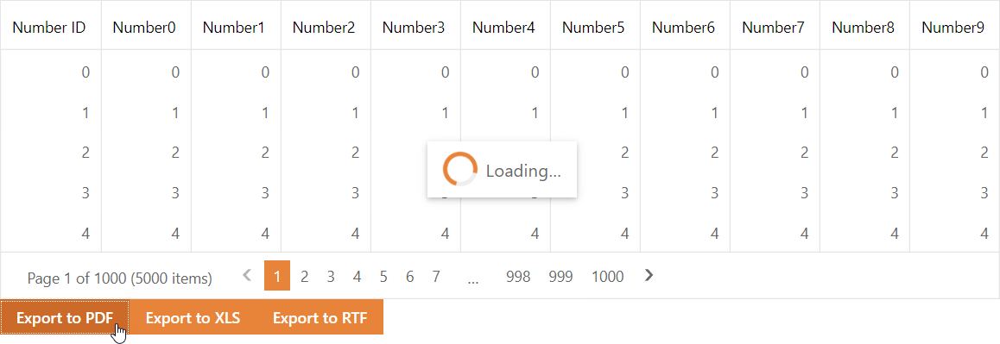

<!-- default badges list -->

[](https://supportcenter.devexpress.com/ticket/details/E2293)
[](https://docs.devexpress.com/GeneralInformation/403183)
<!-- default badges end -->
# Grid View for ASP.NET Web Forms - How to show an ASPxLoadingPanel during export
<!-- run online -->
**[[Run Online]](https://codecentral.devexpress.com/e2293/)**
<!-- run online end -->

This example demonstrates how to display the [ASPxLoadingPanel](https://docs.devexpress.com/AspNet/DevExpress.Web.ASPxLoadingPanel) while the Grid View is exporting data.



## Implementation Details

You can show the loading panel on the client when you start the export process. There are no client events that signal that the export is complete and the loading panel should be hidden. This example illustrates how to use the [ASPxCallback](https://docs.devexpress.com/AspNet/DevExpress.Web.ASPxCallback) control to negate this limitation.

1. Use the callback control's [PerformCallback](https://docs.devexpress.com/AspNet/js-ASPxClientCallback.PerformCallback(parameter)) client event to start the export process.

    ```js
    function onExportWithCallbackClick(exportType) {
        loadingPanel.Show();
        ExportCallback.PerformCallback(exportType);
    }
    ```

2. Handle the callback control's [Callback](https://docs.devexpress.com/AspNet/DevExpress.Web.ASPxCallback.Callback) server event. In the event handler, use the DevExpress printing API to export the grid data to the specified format and save the result to a stream.

    ```cs
    protected void ExportCallback_Callback(object source, CallbackEventArgs e) {
        PrintingSystemBase ps = new PrintingSystemBase();
        PrintableComponentLinkBase lnk = new PrintableComponentLinkBase(ps);
        lnk.Component = MyGridExporter;

        CompositeLinkBase compositeLink = new CompositeLinkBase(ps);
        compositeLink.Links.AddRange(new object[] { lnk });
        compositeLink.CreateDocument();

        MemoryStream stream = new MemoryStream();
        string type = e.Parameter.ToString();

        switch (type) {
            case "pdf":
                compositeLink.PrintingSystemBase.ExportToPdf(stream);
                break;
            case "xls":
                compositeLink.PrintingSystemBase.ExportToXls(stream);
                break;
            case "rtf":
                compositeLink.PrintingSystemBase.ExportToRtf(stream);
                break;
        }

        Session["ExportStream"] = stream;
        Session["type"] = type;
    }
    ```

3. After the callback is processed on the server and returns to the client, you can handle the result in the callback control's [`CallbackComplete`](https://docs.devexpress.com/AspNet/js-ASPxClientCallback.CallbackComplete) event handler. Initiate a postback to download the exported file.

    ```js
    function ExportCallbackComplete(s, e) {
        loadingPanel.Hide();
        response_btn.DoClick();
    }
    ```

4. On the server, write the file data to the response as shown below.

    ```cs
    protected void response_btn_Click(object sender, EventArgs e) {
        MemoryStream stream = Session["ExportStream"] as MemoryStream;
        string type = Session["type"].ToString();
        WriteToResponse(MyGrid.ID, true, type, stream);
    }
    protected void WriteToResponse(string fileName, bool saveAsFile, string fileFormat, MemoryStream stream) {
        if (Page == null || Page.Response == null) return;
        string disposition = saveAsFile ? "attachment" : "inline";
        Page.Response.Clear();
        Page.Response.Buffer = false;
        Page.Response.AppendHeader("Content-Type", string.Format("application/{0}", fileFormat));
        Page.Response.AppendHeader("Content-Transfer-Encoding", "binary");
        Page.Response.AppendHeader("Content-Disposition", string.Format("{0}; filename={1}.{2}", disposition, HttpUtility.UrlEncode(fileName).Replace("+", "%20"), fileFormat));
        Page.Response.BinaryWrite(stream.ToArray());
        Page.Response.End();
    }
    ```

## Files to Look At

- [Default.aspx](./CS/Solution/Default.aspx) (VB: [Default.aspx](./VB/Solution/Default.aspx))
- [Default.aspx.cs](./CS/Solution/Default.aspx.cs) (VB: [Default.aspx.vb](./VB/Solution/Default.aspx.vb))

## Documentation

- [ASPxGridViewExporter](https://docs.devexpress.com/AspNet/DevExpress.Web.ASPxGridViewExporter)
- [Export Grid View Data](https://docs.devexpress.com/AspNet/3791/components/grid-view/concepts/export)
- [Callback Control](https://docs.devexpress.com/AspNet/8274/components/multi-use-site-controls/callback-control)

## More Examples

- [Grid View for ASP.NET Web Forms - How to display data from an uploaded Excel file](https://github.com/DevExpress-Examples/aspxgridview-upload-and-display-excel-file)